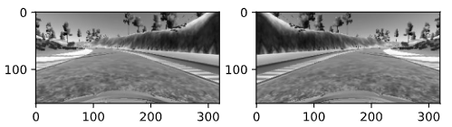
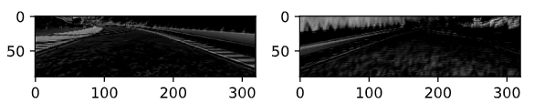
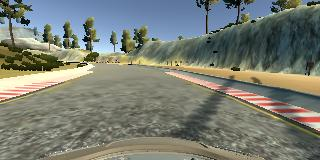
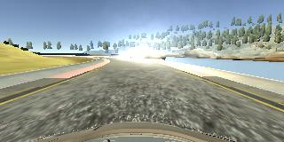
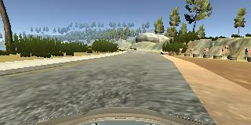
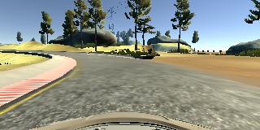
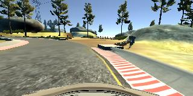
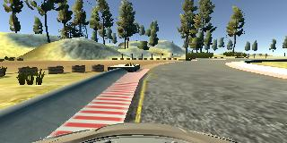

# **Behavioral Cloning**

**Behavioral Cloning Project**

The goals / steps of this project are the following:
* Use the simulator to collect data of good driving behavior
* Build, a convolution neural network in Keras that predicts steering angles from images
* Train and validate the model with a training and validation set
* Test that the model successfully drives around track one without leaving the road
* Summarize the results with a written report

## Rubric Points
### Here I will consider the [rubric points](https://review.udacity.com/#!/rubrics/432/view) individually and describe how I addressed each point in my implementation.

---
## Files Submitted & Code Quality

### 1. Submission includes all required files and can be used to run the simulator in autonomous mode

My project includes the following files:
* model.py containing the script to create and train the model
* drive.py for driving the car in autonomous mode
* model.h5 containing a trained convolution neural network
* writeup_report.md or writeup_report.pdf summarizing the results

### 2. Submission includes functional code
Using the Udacity provided simulator and my drive.py file, the car can be driven autonomously around the track by executing
```sh
python drive.py model.h5
```

### 3. Submission code is usable and readable

The model.py file contains the code for training and saving the convolution neural network. The file shows the pipeline I used for training and validating the model, and it contains comments to explain how the code works.

## Model Architecture and Training Strategy

### 1. An appropriate model architecture has been employed

By experimenting and later consulting the Guide (https://s3-us-west-1.amazonaws.com/udacity-selfdrivingcar/Behavioral+Cloning+Cheatsheet+-+CarND.pdf), I choosed the NVidia model since it immediately showed very good performance. I basically used the layer sizes as in example from materials, but I did add the dropout layer which showed its benefits in earlier project.

### 2. Attempts to reduce overfitting in the model

The model has a dropout layer introduced to prevent overfitting (model.py line 134).

The model was trained and validated on different data sets to ensure that the model was not overfitting (code line 153-170). The model was tested by running it through the simulator and ensuring that the vehicle could stay on the track.

### 3. Model parameter tuning

The model used an adam optimizer, so the learning rate was not tuned manually (model.py line 146).

### 4. Appropriate training data

Training data was chosen to keep the vehicle driving on the road. I used a combination of center lane driving, recovering from the left and right sides of the road, and also added special training sets. The special training sets were introduced to fix some more 'stubborn' problems, such as when car tended to wheer outside the road where road ledges were missing. By random picking (uniformly) from each category the training process finaly resulted in the model that handled those cases as well.

During simulation the only input that model has is the image of the car front area. Since dynamic models of physical bodies have two degree of freedom, position and speed, I concluded that it would be a good idea to eliminate the factor of changing speeds during the training. I tried to maintain speed of 15 miles per hour while collecting data, and also modifed the setpoint of the PI controller to maintain that speed during the simulation.

Input data for the model are grayscaled versions of the 'Center' image. Here is the example of the grayscaled input image, and the output (prediction) of one of convolutional layer to that image:



    Grayscaled input image



    Prediction of one of convolutional layers

## Model Architecture and Training Strategy

### 1. Solution Design Approach

Convolutional layer in the model seemed as the correct choice, since the model receives visual data as input. Similarly to the 'Traffic sing recognition' problem, the convolutional layers enable the NN to recognize characteristic shapes on the image that may correspond to road edges and lines. These then provide the basis for fully connected layers to categorize these shapes and provide correct outputs.

I started with simple models such as LeNet architecture, as the basis for the experiments. Since it didn't show significant performance improvement after several experiments, I went to try some of the specialized architectures. Finally, I opted for the Nvidia type architecture.

Generaly, the model showed fairly similar accuracy for the test and validation sets. I used 5 epochs for the training, and the final results were (mse):

    252s 17s/step - loss: 0.0209 - val_loss: 0.0194

These errors appear relatively small compared to the range of the steering angle values (in radians), and there is no significant difference to suggest overfitting.

The final model was able to complete the first track without leaving the road, in both directions. I didn't use the data from the second track.

### 2. Final Model Architecture

The final model architecture (model.py lines 100-146) is basically the adaption of the NVidia model. Here is the detailed structure of the model (obtained by calling 'summary' function):

    Model: "sequential"
    _________________________________________________________________
    Layer (type)                 Output Shape              Param #
    =================================================================
    cropping2d (Cropping2D)      (None, 88, 320, 1)        0
    _________________________________________________________________
    lambda (Lambda)              (None, 88, 320, 1)        0
    _________________________________________________________________
    conv2d (Conv2D)              (None, 88, 320, 24)       624
    _________________________________________________________________
    max_pooling2d (MaxPooling2D) (None, 44, 160, 24)       0
    _________________________________________________________________
    conv2d_1 (Conv2D)            (None, 40, 156, 36)       21636
    _________________________________________________________________
    max_pooling2d_1 (MaxPooling2 (None, 20, 78, 36)        0
    _________________________________________________________________
    conv2d_2 (Conv2D)            (None, 16, 74, 48)        43248
    _________________________________________________________________
    max_pooling2d_2 (MaxPooling2 (None, 8, 37, 48)         0
    _________________________________________________________________
    conv2d_3 (Conv2D)            (None, 6, 35, 64)         27712
    _________________________________________________________________
    conv2d_4 (Conv2D)            (None, 4, 33, 64)         36928
    _________________________________________________________________
    flatten (Flatten)            (None, 8448)              0
    _________________________________________________________________
    dense (Dense)                (None, 100)               844900
    _________________________________________________________________
    dropout (Dropout)            (None, 100)               0
    _________________________________________________________________
    dense_1 (Dense)              (None, 50)                5050
    _________________________________________________________________
    dense_2 (Dense)              (None, 1)                 51
    =================================================================
    Total params: 980,149
    Trainable params: 980,149
    Non-trainable params: 0

All convolutional layers use RELU activation function, but fully connected layer use simple linear activation (a(x) = x). For the similar reasons as in the previous project (traffic signs), I used grayscaled images to reduce input space and reduce memory and training times. One difficulty that occured is that 'drive.py' loaded images in RGB format, while I used BGR format during training, so the grayscale conversion didn't yield the same results. This substantially reduced the performance of the model until I discovered and fixed the problem.

### 3. Creation of the Training Set & Training Process

As explained earlier, I grouped the data into three different categories: center driving, recentering from the sides, and special situations such as missing road ledges. Here is an example image of center lane driving:




Here is the example images of recentering the car:




Here is the example of images from 'special' category:




I gathered data by driving in both directions arround the first track, and during the training all data is augmented with flipped versions of the data.

From each of the categories an equal number of samples is chossen during each training iteration, to prevent overfitting. I used 20% of the data from each category as a validation set.
